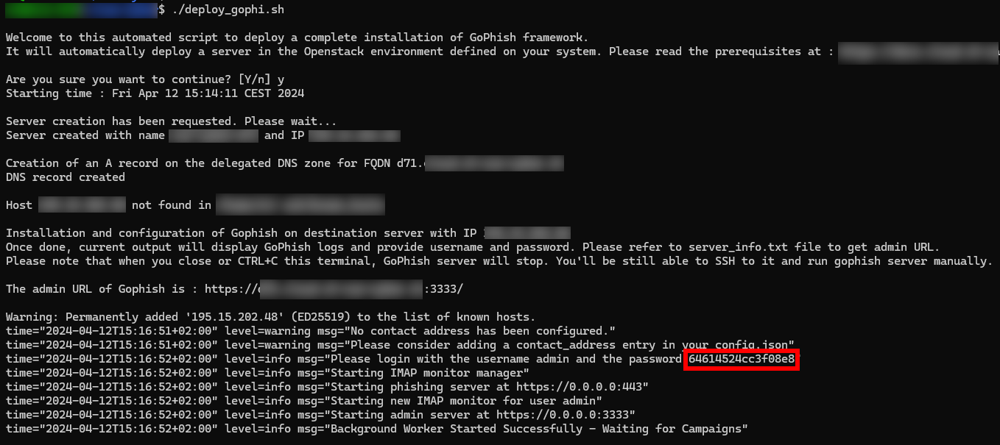

# Automating the deployment of a Gophish instance in an Openstack environment

## Introduction

This script enables you to deploy a GoPhish instance in an Openstack environment.

## What does it do ?

You'll need these 3 files for running this script :

| Filename | Usage |
|--|--|
| deploy_gophi.sh | Main script |
| config.json | GoPhish config that we will push |
| server_info.txt | Find info of the last server deployed |

The script "deploy_gophi.sh" will :

- Creating a random name for the Openstack instance
- Deploy an Openstack instance in the Infomaniak Public Cloud
- Create a DNS record pointing to the newly created server
- Copy a configuration file for GoPhish
- Install unzip on the remote server
- Download and unzip GoPhish
- Install certbot
- Generate SSL certificate
- Installing, configuring and starting the GoPhish server

The script output provides all the information required to connect to the solution's administration portal.
However, a "server_info.txt" file is generated when the script is run and contains all the necessary information relating to the freshly deployed server.

### Access to your GoPhish instance

Once running, display the "server_info.txt" file to get all necessary informations about the server.
You'll find on it : 

- The server hostname and instance name on Openstack 
- The admin URL of Gophish 
- The IP address and connection command to connect into it

# Usage

## Prerequisite

Some prerequisites must be met before running the script.

- A linux environment (debian based)
- The "jq" package installed on it
- A domain name
- Access to an Openstack infrastructure
- Your SSH key pair uploaded to Openstack Infrastructure and installed on your machine
- DNS delegation in the Openstack infrastructure
- A SMTP server

### Install jq

On Ubuntu a Debian based machine, run :
```bash
sudo apt install jq
```    
### Access to Openstack infrastructure

Choose the provider that you want. I've tested and run my script succesfully by using the "Public Cloud" infrastructure based on OS from Infomaniak.
Please note that if you change provider, you'll need to adapt the openstack's commands on the script based on your provider's documentation.

Here is an example of configuration file :

```bash
export OS_AUTH_URL=https://api.pub1.infomaniak.cloud/identity/v3
export OS_PROJECT_NAME=xxx
export OS_PROJECT_DOMAIN_NAME=default
export OS_USERNAME=xxx
export OS_USER_DOMAIN_NAME=default
export OS_PROJECT_ID=xxx
export OS_IDENTITY_API_VERSION=3
export OS_INTERFACE=public
export OS_REGION_NAME=xxx
export OS_PASSWORD='xxxxx'
```
Infomaniak's documentation : [https://docs.infomaniak.cloud/documentation/00.getting-started/02.Connect_project/](https://docs.infomaniak.cloud/documentation/00.getting-started/02.Connect_project/)

Do not forget to source the file once completed !

```bash
source < your-file >
```  

### SSH key pair on OS

Upload your SSH key pair to your OS infrastructure provider, It'll be usefull while running the script to permit a passwordless connection to the server.
Naturally, you also need to get it on your local host that is running the script.

### DNS delegation

Please read the documentation of your OS provider.
In my case, I've followed [the one from Infomaniak](https://docs.infomaniak.cloud/documentation/02.network/045.dns/)

## Download and run the script

```bash
git clone https://github.com/alpensys/gophi.sh
cd gophi.sh
chmod +x deploy_gophi.sh
./deploy_gophi.sh
``` 

When it start, you'll need to confirm by using "y" key on the shell.
Then, submit the domain name that you want to use. (Check prerequisite before, in particular regarding [DNS delegation](https://github.com/alpensys/gophi.sh?tab=readme-ov-file#dns-delegation))

Please note that when you close the console or press CTRL+C, the connection to the server is cut and GoPhish is stopped. But the server will still be running. You can connect to it via SSH and restart GoPhish by executing the command :

```bash
cd /home/ubuntu/server && sudo ./gophish
```  

### GoPhish admin password

When the server is running, do not forget to copy the password displayed on the log output.

#### Screenshot



## Usage of GoPhish

Please read the official documentation of GoPhish : [https://docs.getgophish.com/user-guide/getting-started](https://docs.getgophish.com/user-guide/getting-started)

## Versionning

[Please read the releases notes file](https://github.com/alpensys/gophi.sh/blob/main/releases-notes.md)